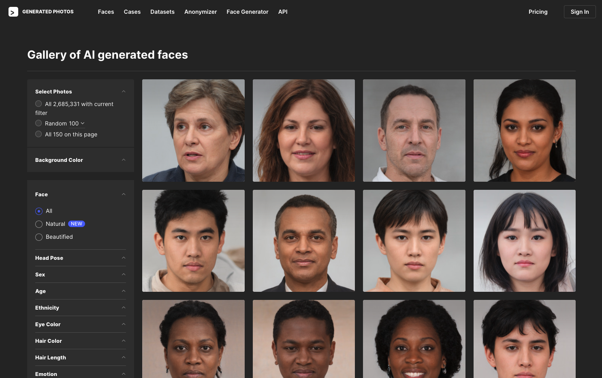
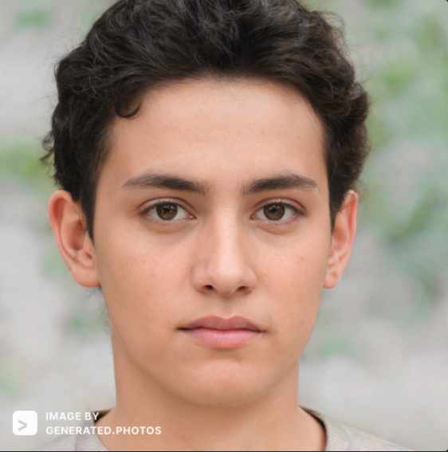
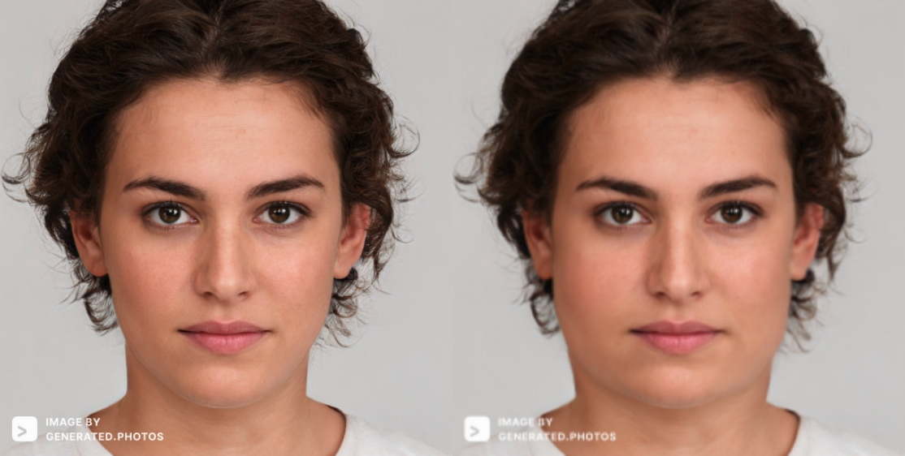

Plasticine is a facial deformation application based on face recognition, made by [Topaz](https://topaz1618.github.io/about)([Website](http://topazaws.com/)|[Blog](https://topaz1618.github.io/blog/))

[Chinese README](https://github.com/Topaz1618/Plasticine/blob/master/README_CN.md)


# Features:
- Support for obtaining key points of the face
- Support deformation of cheeks, chin, cheekbones


# Environment
- Python3
- tensorflow==1.15.0
- OpenCV
- Ubuntu16.04/macOS


## Installation (Ubuntu & macOS)
1. Download Plasticine
```
 git clone git@github.com:Topaz1618/Plasticine.git
```

2. Install dependencies
```
 pip install -r requirements.txt
```

## Run 
```
 python slim_face.py
```


## Face photo source
All test images are from this website, Click to view [AI Generate Face](https://generated.photos/faces/)


You will get photos like the following, and of course there will be a watermark on them .



## Screenshots

## 【Face detection1】

Get the key points of the face (face deformation is based on the key points)


## 【Result1】
Cheeks become larger and the chin becomes smaller


## 【Result2】

Pull all parts of the face outward




## 【Result3】

Push all parts of the face inward


## TODO
- [] Add wxPython, support graphical interface to adjust face deformation, and view the effect in real time


## License
Licensed under the MIT license