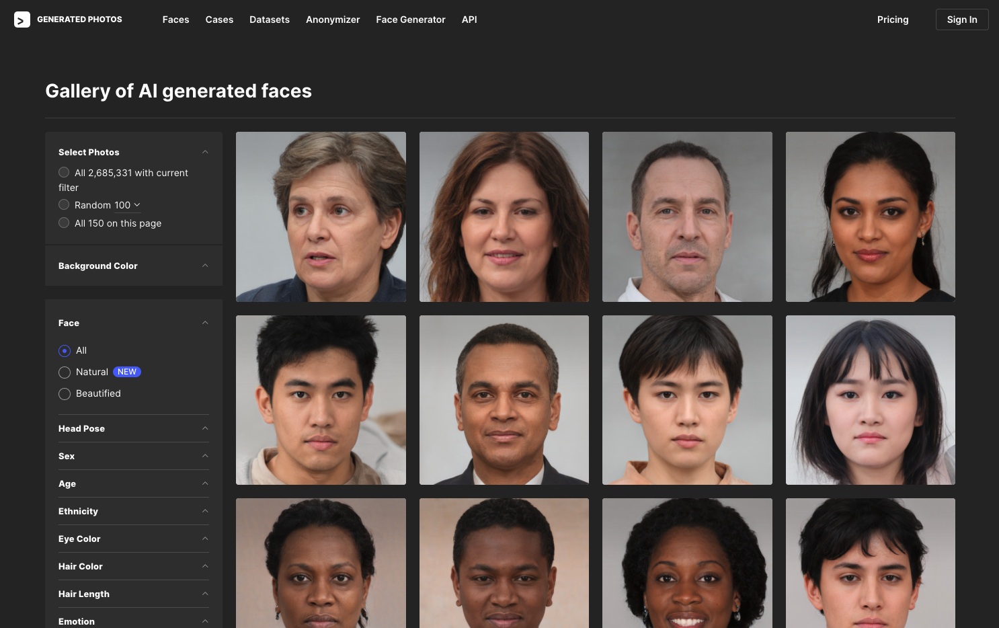
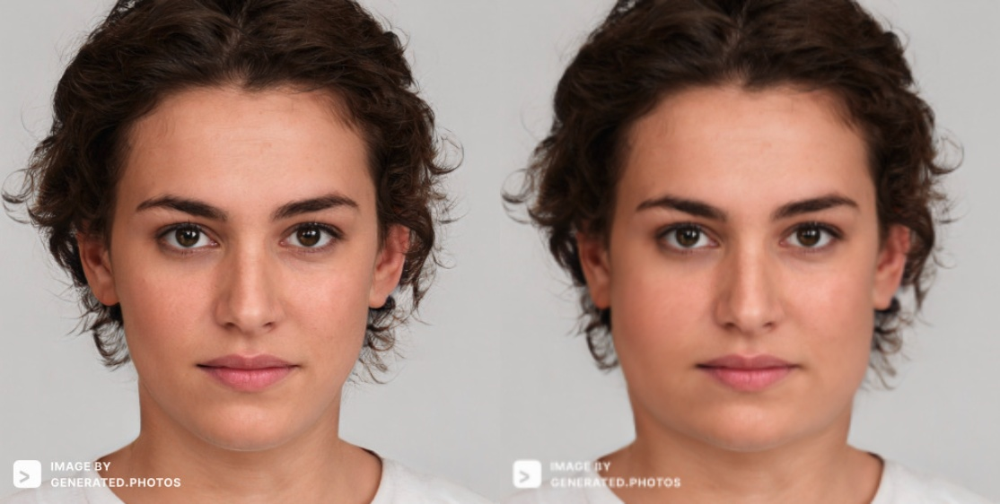

Plasticine is a facial deformation application based on face recognition, made by [Topaz](https://topaz1618.github.io/about)([Website](http://topazaws.com/)|[Blog](https://topaz1618.github.io/blog/))

[Chinese README](https://github.com/Topaz1618/Plasticine/blob/master/README.md)


# Features:
- 支持获取脸部关键点
- 支持下巴，脸颊，颧骨部位的变形


# Environment
- Python3
- tensorflow==1.15.0
- OpenCV
- Ubuntu16.04/macOS
- wxPython


## Installation (Ubuntu & macOS)
1. 下载 Plasticine
```
 git clone git@github.com:Topaz1618/Plasticine.git
```

2. 安装依赖
```
 pip install -r requirements.txt
```

## 运行获取脸部关键点
```
 // The first frame needs to be initialized, so it may take a few seconds
 python single_s3fd.py
```

## 运行脸部变形程序
```
 python slim_face.py
```


## 脸部图片来源
所有测试图片来自这个网站, Click to view [AI Generate Face](https://generated.photos/faces/)


你会获得一张带有水印的如下图片


## Screenshots

## 【Face detection1】

Get the key points of the face (face deformation is based on the key points)


## 【Result1】
一部分向内，一部分向外


## 【Result2】

脸部向外推




## 【Result3】

脸部向内推


## TODO
- [] 图形界面

## License
Licensed under the MIT license